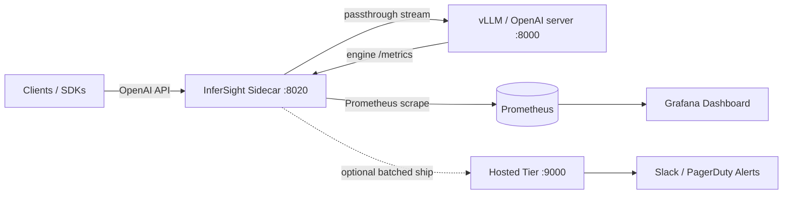
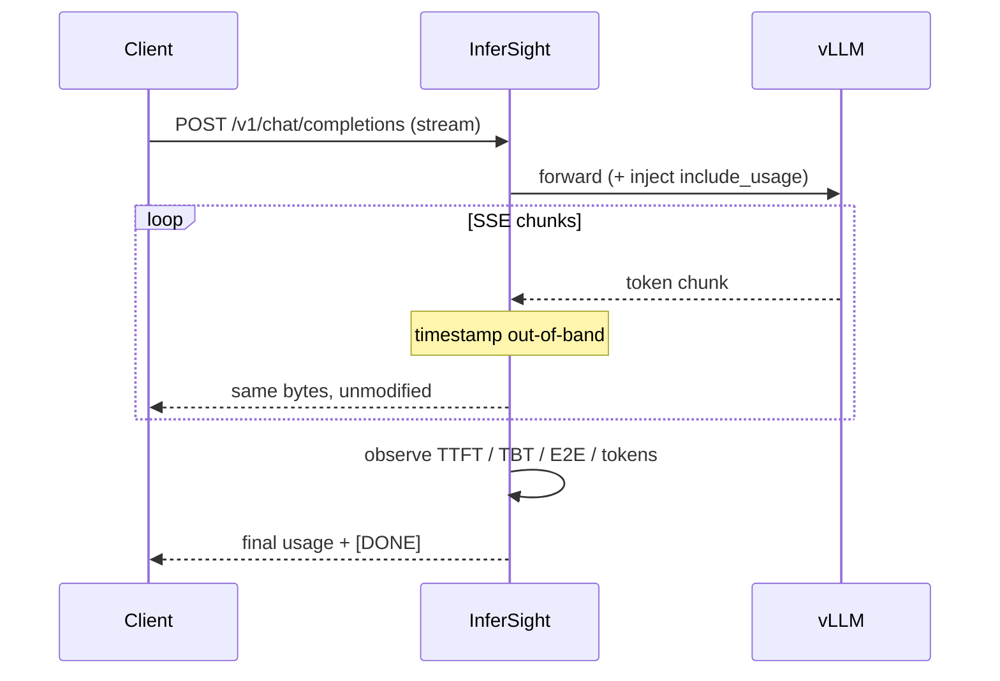
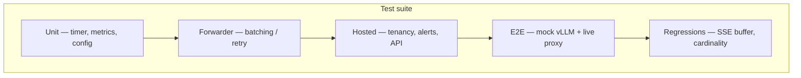

# InferSight

### Purpose-built observability for self-hosted LLM inference

[](https://www.python.org/)
[](LICENSE)
[](tests/)
[](#demo-results)
[](#demo-results)
[](#engine-support)
[](dashboards/)
[](dashboards/infersight-vllm.json)

**Demo results (mock vLLM):** TTFT p50 **84 ms** / p99 **244 ms** · TBT p50 **17 ms** · E2E p50 **384 ms** / p99 **925 ms** · KV-cache **~98%** · **32/32** tests passing.

Your APM says CPU is fine, memory is fine, and every request returns **200** — while users wait seconds for the first token.

Generic monitoring cannot see how LLM serving fails. **InferSight** can.

InferSight is a lightweight sidecar for [vLLM](https://github.com/vllm-project/vllm) (and any OpenAI-compatible server) that measures the signals that matter for inference: **TTFT**, **TBT**, **E2E latency**, **KV-cache pressure**, **scheduler queue depth**, and **exact token throughput**.

<p align="center">
  
</p>

---

## Why InferSight

| Gap in generic APM | What InferSight captures |
| --- | --- |
| Request latency only | **TTFT** — time until the first token (what users feel) |
| No streaming insight | **TBT** — inter-token gaps (decode / smoothness health) |
| No GPU KV visibility | **KV-cache usage** — leading indicator of preemption & OOM |
| Opaque backlogs | **Queue depth** — running / waiting / swapped |
| Approximate token counts | **Exact usage** via injected `stream_options.include_usage` |

---

## Architecture



**Hot-path design:** streamed bytes pass through untouched. Timing uses two `perf_counter()` reads per network chunk — out-of-band of the client response. Overhead stays in the microsecond range.



Full design notes: [docs/architecture.md](docs/architecture.md) · Project report: [docs/REPORT.md](docs/REPORT.md)

---

## Quick start

### 1) Sidecar in front of an existing vLLM

```bash
pip install -e .

infersight run --upstream http://localhost:8000 --port 8020
```

Point clients at `:8020`. Scrape `http://localhost:8020/metrics`. Import [`dashboards/infersight-vllm.json`](dashboards/infersight-vllm.json) into Grafana.

```bash
infersight discover   # probe for OpenAI-compatible / vLLM servers
```

### 2) Full demo stack (no GPU required)

```bash
git clone https://github.com/ArchanaChetan07/InferSight && cd InferSight
docker compose up --build
```

| Service | Default URL |
| --- | --- |
| Mock vLLM | http://localhost:8000 |
| InferSight sidecar | http://localhost:8020 |
| Prometheus | http://localhost:9090 |
| Grafana (anon Admin) | http://localhost:3000 |
| Hosted tier (optional) | http://localhost:9000 |

If host ports are taken:

```bash
MOCK_PORT=18080 SIDECAR_PORT=18020 PROM_PORT=19091 GRAFANA_PORT=13001 HOSTED_PORT=19000 \
  docker compose up --build
```

---

## Metrics surface

| Metric | Type | Purpose |
| --- | --- | --- |
| `infersight_ttft_seconds` | Histogram | Time to first token |
| `infersight_tbt_seconds` | Histogram | Time between tokens |
| `infersight_e2e_latency_seconds` | Histogram | End-to-end request latency |
| `infersight_prompt_tokens_total` | Counter | Prompt tokens |
| `infersight_completion_tokens_total` | Counter | Completion tokens |
| `infersight_requests_total` | Counter | Requests by status |
| `infersight_requests_in_flight` | Gauge | Concurrent requests |
| `infersight_kv_cache_usage_ratio` | Gauge | Engine KV-cache utilization |
| `infersight_queue_depth` | Gauge | Scheduler running / waiting / swapped |

Grafana panels (pre-built): TTFT · TBT · E2E · Throughput · KV-cache · Queue · In-flight & error rate.

---

## Demo results

Measured against the included **mock vLLM** + InferSight sidecar + Prometheus stack (model: `meta-llama/Llama-3.1-8B-Instruct`).

<p align="center">
  
</p>

<p align="center">
  
</p>

<p align="center">
  
</p>

### Snapshot

| Signal | P50 | P99 |
| --- | ---: | ---: |
| **TTFT** | 84 ms | 244 ms |
| **TBT** | 17 ms | 39 ms |
| **E2E latency** | 384 ms | 925 ms |

| Volume / health | Value |
| --- | ---: |
| Requests observed | 18 (17 × HTTP 200) |
| Prompt tokens | 4,291 |
| Completion tokens | 300 |
| KV-cache usage | ~98% |
| Queue (running / waiting) | 7 / 3 |

> Values reflect a local demo workload. Re-run `docker compose up` and send traffic through the sidecar to regenerate live series in Grafana.

```mermaid
xychart-beta
  title "Demo latency percentiles (ms)"
  x-axis [TTFT, TBT, E2E]
  y-axis "Milliseconds" 0 --> 1000
  bar [84, 17, 384]
  bar [244, 39, 925]
```



---

## Hosted tier (optional)

Ship metrics without running Prometheus/Grafana yourself:

```bash
infersight run --upstream http://localhost:8000 \
  --hosted-api-key isk_your_key
```

Includes:

- Zero-ops dashboard (TTFT / TBT / E2E percentiles, throughput, errors)
- LLM-aware alerts to Slack / PagerDuty (P99 regressions, KV pressure, error spikes)
- Multi-model / multi-cluster comparison tables

Self-host the ingest API from this repo:

```bash
uvicorn hosted.ingest:app --port 9000
curl -X POST localhost:9000/v1/admin/tenants \
  -H "Authorization: Bearer $INFERSIGHT_ADMIN_TOKEN" \
  -H "Content-Type: application/json" \
  -d '{"name":"my-team"}'
```

---

## Configuration

Precedence: **CLI flags → `INFERSIGHT_*` env → `--config` file → defaults**

```bash
INFERSIGHT_UPSTREAM_URL=http://vllm:8000
INFERSIGHT_LISTEN_PORT=8020
INFERSIGHT_HOSTED__API_KEY=isk_...    # nested keys use __
```

See [docs/configuration.md](docs/configuration.md).

---

## Engine support

| Engine | Request timing | KV cache / queue |
| --- | :---: | :---: |
| **vLLM** | Yes | Yes |
| Any OpenAI-compatible server | Yes | — |
| TGI / SGLang gauges | Planned | Planned |

---

## Repository layout

```text
InferSight/
├── infersight/          # Sidecar proxy, metrics, discovery, CLI
├── hosted/              # Optional multi-tenant ingest + alerts + UI
├── dashboards/          # Import-ready Grafana JSON
├── deploy/              # Prometheus + Grafana provisioning
├── examples/mock_vllm.py
├── tests/               # 32 unit / hosted / e2e / regression tests
├── docs/                # Architecture, config, limitations, report, assets
└── docker-compose.yml   # One-command demo stack
```

---

## Development

```bash
pip install -e ".[dev]"
pytest                   # 32 tests
```



---

## Documentation

| Document | Contents |
| --- | --- |
| [docs/REPORT.md](docs/REPORT.md) | Full project report — goals, design, results, roadmap |
| [docs/architecture.md](docs/architecture.md) | Design decisions & data model |
| [docs/configuration.md](docs/configuration.md) | Config reference |
| [docs/limitations.md](docs/limitations.md) | Known limitations (v0.1) |

---

## Topics / tags

`llm` · `vllm` · `observability` · `prometheus` · `grafana` · `inference` · `ttft` · `streaming` · `openai-compatible` · `fastapi` · `sidecar` · `kv-cache` · `sre` · `mlops`

---

## License & author

Apache-2.0. Built by [Archana Suresh Patil](mailto:apatil@sandiego.edu).

Feedback and design partners welcome — open an issue on [GitHub](https://github.com/ArchanaChetan07/InferSight).
