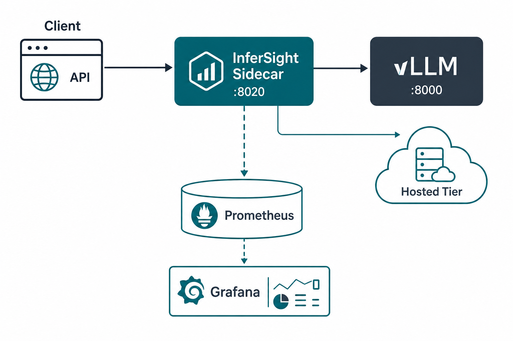
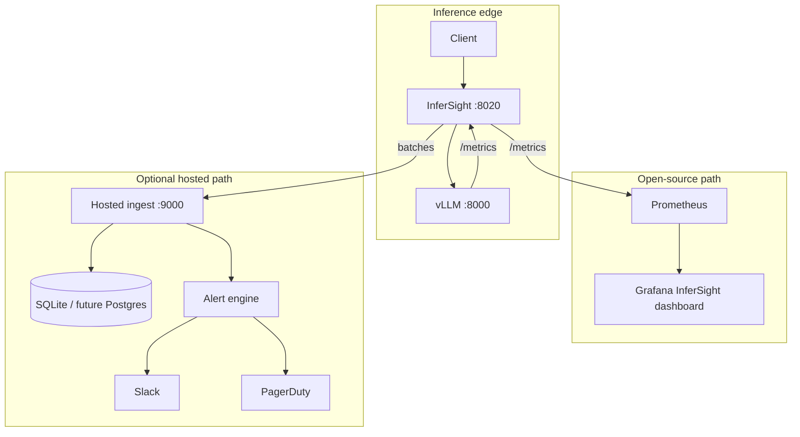
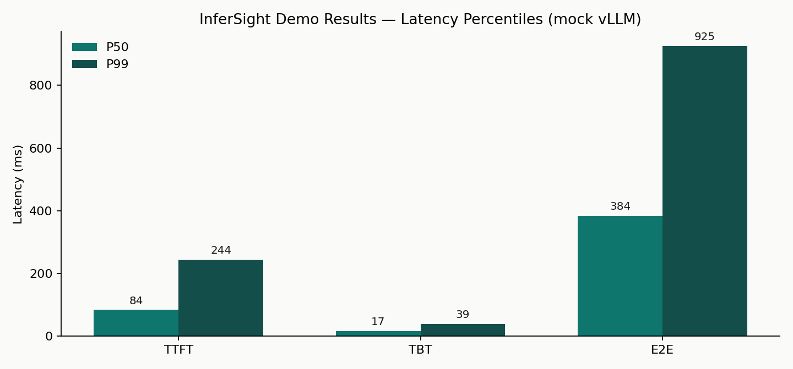
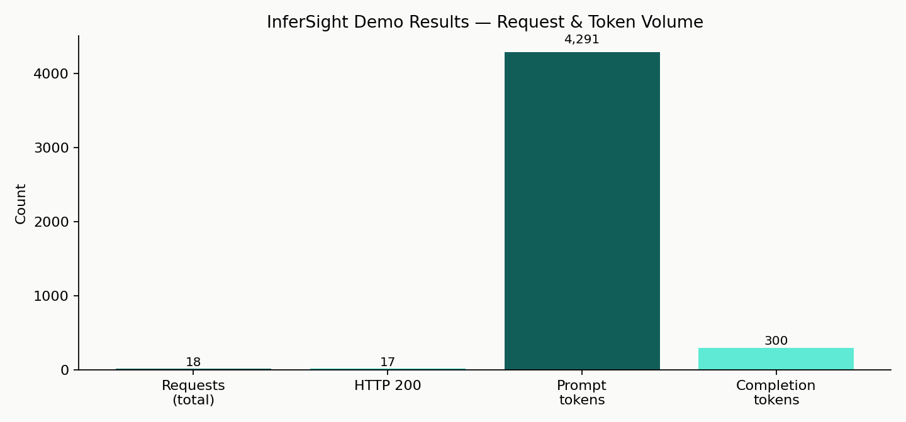
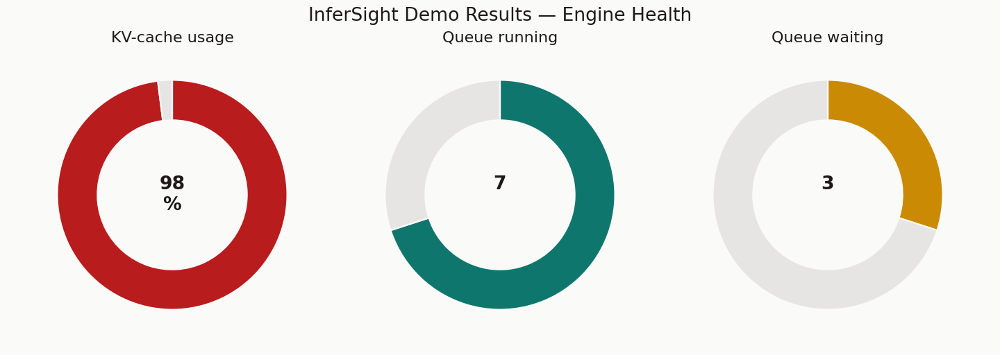

# InferSight — Project Report

**Version:** 0.1.0  
**Author:** Archana Suresh Patil  
**Repository:** [github.com/ArchanaChetan07/InferSight](https://github.com/ArchanaChetan07/InferSight)  
**License:** Apache-2.0  
**Status:** Beta — demo stack verified, 32/32 tests passing  

---

## 1. Executive summary

InferSight is an observability sidecar purpose-built for **self-hosted LLM inference**. It sits transparently between clients and a vLLM (or OpenAI-compatible) server and exports the metrics that generic APM tools miss: time-to-first-token (TTFT), time-between-tokens (TBT), end-to-end latency percentiles, KV-cache pressure, scheduler queue depth, and exact token counts.

The project ships as:

1. A production-oriented **sidecar proxy** (`infersight/`)
2. An optional **hosted ingest + alerting tier** (`hosted/`)
3. **Prometheus + Grafana** provisioning and an import-ready dashboard
4. A **GPU-free demo stack** (`docker compose`) with a mock vLLM

---

## 2. Problem statement

Operators running vLLM in production routinely encounter this failure mode:

- CPU, memory, and HTTP status codes look healthy
- Users experience multi-second “blank” delays before the first token
- KV-cache exhaustion causes preemption or OOM with little warning in standard dashboards

Root cause: **inference quality is a token-timeline problem**, not a host-resource problem. Measuring only request RTT or GPU utilization is insufficient.

InferSight closes that gap at the HTTP boundary — without forking or patching the engine.

---

## 3. Goals & non-goals

### Goals

| Goal | Approach |
| --- | --- |
| Measure user-perceived streaming latency | Out-of-band TTFT / TBT on SSE passthrough |
| Predict capacity cliffs | Scrape vLLM KV-cache + queue gauges |
| Zero engine changes | Transparent OpenAI-compatible proxy |
| Ops-ready visualization | Prometheus metrics + Grafana JSON |
| Optional SaaS path | Batched hosted ingest + LLM-aware alerts |

### Non-goals (v0.1)

- Replacing distributed tracing (OpenTelemetry spans)
- Engine-step-accurate TBT under multi-token network flushes
- Multi-replica engine-state reconciliation (latest-write-wins today)
- Built-in TLS termination / rate limiting (front with a reverse proxy)

See [limitations.md](limitations.md) for the full honesty list.

---

## 4. System architecture





### Design principles

1. **Proxy, not fork** — stable across vLLM versions; works for any OpenAI-compatible API
2. **Timing before parsing** — timestamps first; client bytes unmodified
3. **Fail-open shipping** — hosted forwarder never back-pressures inference
4. **Server-side tenancy** — API key → tenant; client-supplied tenant fields ignored
5. **SQLite first** — zero-ops MVP with a clean storage seam for scale-out

---

## 5. Measurement model

| Signal | Definition | Source |
| --- | --- | --- |
| **TTFT** | Wall time from request start → first SSE content chunk | Sidecar `StreamTimer` |
| **TBT** | Gap between successive network reads containing data lines | Sidecar `StreamTimer` |
| **E2E** | Full request duration | Sidecar |
| **Tokens** | Prompt / completion counts | Injected `stream_options.include_usage` (fallback: content chunk count) |
| **KV-cache** | `vllm:gpu_cache_usage_perc` | Background scrape of engine `/metrics` |
| **Queue** | running / waiting / swapped | Background scrape |

Cardinality of the `model` label is capped (`max_model_labels`, overflow → `__other__`) to protect Prometheus.

---

## 6. Validation & quality

### Automated tests

| Suite | Coverage |
| --- | --- |
| `test_core` | Config precedence, StreamTimer, metrics registry, engine metric parse |
| `test_forwarder` | Batch ship, engine-state ship, requeue on failure |
| `test_hosted` | Tenant isolation, percentiles, alerts, API flow, batch limits |
| `test_proxy_e2e` | Live mock vLLM + sidecar (health, stream, gauges, 502) |
| `test_regressions` | SSE reassembly, label cap, flush caps, retention prune |

**Result: 32 / 32 tests passing** on Windows (Python 3.11) and in the Docker demo environment.

### Demo stack smoke checks

| Check | Result |
| --- | --- |
| Sidecar `/infersight/health` | `200` / `ok` |
| Chat completion via sidecar | `200` |
| Streaming TTFT/TBT metrics present | Yes |
| Prometheus target `infersight` | `up` |
| Grafana health | `200` |
| Hosted UI | `200` |

---

## 7. Empirical demo results

Workload: mock vLLM (`ttft≈80ms`, `tbt≈15ms`) behind InferSight; model label `meta-llama/Llama-3.1-8B-Instruct`.







### Latency percentiles

| Metric | P50 | P90 | P99 |
| --- | ---: | ---: | ---: |
| TTFT | 84 ms | 194 ms | 244 ms |
| TBT | 17 ms | — | 39 ms |
| E2E | 384 ms | — | 925 ms |

### Volume & engine state

| Metric | Value |
| --- | ---: |
| Total requests | 18 |
| Successful (HTTP 200) | 17 |
| Prompt tokens | 4,291 |
| Completion tokens | 300 |
| KV-cache usage | ~98% |
| Queue running | 7 |
| Queue waiting | 3 |

These figures demonstrate that InferSight correctly surfaces both **request-level streaming latency** and **engine pressure gauges** on a single dashboard.

---

## 8. Grafana dashboard inventory

Dashboard UID: `infersight-vllm` · Refresh: 10s · Variable: `model`

| Panel | Query intent |
| --- | --- |
| TTFT — P50 / P90 / P99 | `histogram_quantile` on `infersight_ttft_seconds_bucket` |
| TBT — P50 / P99 | `histogram_quantile` on `infersight_tbt_seconds_bucket` |
| E2E — P50 / P99 | `histogram_quantile` on `infersight_e2e_latency_seconds_bucket` |
| Throughput | `rate(requests)` + `rate(completion_tokens)` |
| KV-cache usage | Gauge with 75% / 92% thresholds |
| Scheduler queue depth | `infersight_queue_depth` by state |
| In-flight & error rate | Gauge + error ratio |

---

## 9. Hosted alerting model

| Rule | Trigger idea |
| --- | --- |
| `p99_regression` | Recent P99 >> baseline window by configured % |
| `kv_cache_pressure` | KV usage high / trending toward exhaustion |
| `error_rate` | Non-2xx ratio above threshold |

Alerts support Slack webhooks and PagerDuty routing keys, with per-rule cooldowns to avoid page storms.

---

## 10. Repository structure

```text
infersight/     Sidecar (proxy, metrics, discovery, CLI, forwarder)
hosted/         Multi-tenant ingest, storage, alerts, static UI
dashboards/     Grafana JSON
deploy/         Prometheus + Grafana provisioning Docker bits
examples/       Mock vLLM for demos & e2e
tests/          Unit, hosted, e2e, regression
docs/           Architecture, config, limitations, this report, assets
```

---

## 11. Roadmap

| Priority | Item |
| --- | --- |
| Near-term | TGI / SGLang engine gauge parsers |
| Near-term | Persist model-label cardinality across restarts |
| Mid-term | Pre-aggregated percentile rollups for high volume |
| Mid-term | Per-replica engine-state keys (cluster + replica) |
| Longer | Engine plugin for step-accurate TBT |

---

## 12. Conclusion

InferSight proves that **LLM-native observability can be delivered as a thin, fail-open sidecar** without modifying the inference engine. The combination of token-timeline histograms, KV/queue gauges, import-ready Grafana, and an optional hosted alert path gives operators a practical way to detect the failures users actually feel — long before host metrics turn red.

---

*Report generated from InferSight v0.1.0 demo measurements and the current test suite.*
